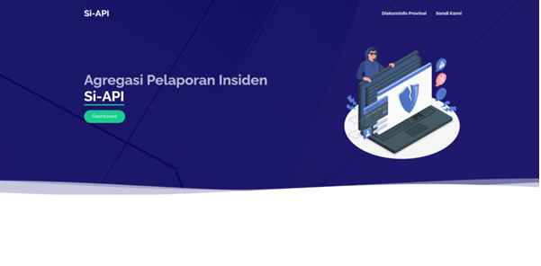

## Si-API

"Si API" is a platform for aggregating and managing incident reports. It simplifies the process of collecting, organizing, and tracking various incidents, providing a centralized system for efficient reporting and analysis.

## Preview

|                       Dashboard                       |                     Login                     |                       Rekap Data                        |                       Home Page                       |
| :---------------------------------------------------: | :-------------------------------------------: | :-----------------------------------------------------: | :---------------------------------------------------: |
|  |  |  |  |

## Framework and Template

  
  

<h1 align="center">Laravel Stisla</h1>

**Laravel Stisla** is a Free Bootstrap Admin Template which will help you to speed up your project and design your own dashboard UI using Laravel blade templating engine.

## Quick start

Several quick start options are available:

-   Clone the repo: `git clone https://github.com/evelynn30/siAPI.git`
-   Run `cd` to the newly created `/namefolder` directory
-   Run `composer install` command
-   Run `cp .env.example .env` command
-   Run `php artisan key:generate` command
-   Run `php artisan serve` command
-   Done

-   //Optional
-   Run `npm install` command
-   Run `npm run dev` command

-   //Feel free to ask about this project

## License

**Stisla** is licensed under the [MIT License](LICENSE)

    The Laravel framework is open-sourced software licensed under the 
    <a href="https://opensource.org/licenses/MIT" rel="nofollow">MIT license</a>

"# siAPI"
